<div align="center">

<picture>
  <source media="(prefers-color-scheme: dark)" srcset="assets/header-dark.svg">
  
</picture>

<br><br>


</div>

```yaml
# ~/.profile
now:
  researching:  "does sharing reasoning between agents make them auditable — or just more persuasive?"
  building:     "AI tooling that shows its work, with a human in the loop"
  learning:     "OpenShift from container to public route · ESP32 hardware · local LLM benchmarking"
rules:
  - never trust client input
  - secrets stay out of code
  - simple and secure beats clever
  - publish the negative result
```

## 🔬 Featured work

<table>
<tr>
<td width="50%" valign="top">

### 🧠 [ARM-Protocol](https://github.com/socks5-sniffer/ARM-Protocol)
**Agent Reasoning Markup** · research · Apache-2.0

Agents pass full reasoning traces — assumptions, discarded alternatives, confidence — instead of bare conclusions, so peers can audit the logic rather than inherit it.

Four-agent mesh, two rounds, plus a permanently isolated **γ-Silent** control agent. Any provider in any slot (Claude · GPT · Gemini).

`React` `Vite` `OpenShift` `OWASP scan`

</td>
<td width="50%" valign="top">

### 🤖 [SCRUMtious](https://github.com/socks5-sniffer/SCRUMtious)
**One feature idea in, a full sprint out** · MIT

Five AI agents — BA → PO → Dev → Security Auditor → Scrum Master — stream live to the UI, with a **human approval gate after every stage**. The auditor returns an explicit `APPROVED` / `BLOCKED`.

`FastAPI` `CrewAI` `Gemini` `SSE` `CodeQL`

</td>
</tr>
<tr>
<td width="50%" valign="top">

### 🥒 [picklePi](https://github.com/socks5-sniffer/picklePi)
**Electronics + Python on the Raspberry Pi** · MIT

13 levels, first LED blink → working tamper-monitoring security system. Full lessons, not snippets: wiring, safety, runnable code, line-by-line walkthroughs, badges, lab notebook.

`React 19` `TypeScript` `Flask` `Firebase` `strict CSP`

</td>
<td width="50%" valign="top">

### ☁️ [learning-openshift](https://github.com/socks5-sniffer/learning-openshift)
**Cloud-native, learned in public**

A Next.js app deployed to Red Hat OpenShift via Dev Spaces, with interactive Kubernetes tutorials. Documents the mistakes and fixes, not just the working build.

`Next.js` `TypeScript` `OpenShift` `Kubernetes`

</td>
</tr>
</table>

## 📓 Lab notebook: the result that didn't work

> **Claim:** confidence-magnitude drift detects when a false premise has contaminated a multi-agent consensus.
>
> **Test:** ground-truthed injection experiment ([`experiments/c1vc2/`](https://github.com/socks5-sniffer/ARM-Protocol)) — plant a known-false premise, check whether drift separates contaminated agents from clean ones.
>
> **Result:** chance. Within-Gemini **AUC ≈ 0.48**. The detector is falsified.

What survived:

| Signal | Status |
| :--- | :--- |
| Confidence-magnitude drift | ❌ falsified — AUC ≈ 0.48 |
| **IPR** — injection-propagation rate (did an agent *adopt* a premise authored as false?) | ✅ surviving, falsifiable |
| Polarity gate, firm yes↔no transitions | ⚠️ catches ~36% of inferred contaminations at 40% precision |
| RLHF bias audit | 🔬 runs every reconciliation round |

A metric that can't fail isn't a metric. So the failure goes in the README, not a footnote.

<details>
<summary><b>🔐 Security details worth checking</b></summary>
<br>

- **picklePi** — every `/api/progress` route requires a verified Firebase ID token, *and* the URL's `userId` must match the uid inside that token. Changing the URL can't read someone else's data.
- **picklePi** — strict CSP, `frame-ancestors 'none'`, HSTS preload, all shipped in `vercel.json`.
- **SCRUMtious** — per-session tokens via HttpOnly cookie on protected endpoints; sessions persist to disk and reload on startup.
- **All three flagship repos** — CodeQL and/or an OWASP scan run in GitHub Actions.

</details>

<details>
<summary><b>🛠️ Full stack</b></summary>
<br>

| Category | Tools |
| :--- | :--- |
| **Languages** | Python, TypeScript, JavaScript, C/C++ (ESP32) |
| **Frontend** | React, Next.js, Vite, Tailwind CSS |
| **Backend** | FastAPI, Flask, Express |
| **AI** | Anthropic Claude, Google Gemini, OpenAI, CrewAI, local LLMs |
| **Cloud** | OpenShift, Google Cloud, Firebase, Vercel |
| **Data** | Firestore, SQLite, PostgreSQL |
| **Tooling** | Git, GitHub Actions, Docker/Podman, CodeQL, Cloudflare |
| **Hardware** | Raspberry Pi, ESP32-S3 / C3 |

</details>

## 📊 Activity

<div align="center">

<picture>
  <source media="(prefers-color-scheme: dark)" srcset="https://github-readme-stats.vercel.app/api?username=socks5-sniffer&show_icons=true&hide_border=true&include_all_commits=true&theme=github_dark&title_color=5bcdec&icon_color=5bcdec&bg_color=0d1117">
  
</picture>
<picture>
  <source media="(prefers-color-scheme: dark)" srcset="https://github-readme-stats.vercel.app/api/top-langs/?username=socks5-sniffer&layout=compact&hide_border=true&langs_count=8&theme=github_dark&title_color=5bcdec&bg_color=0d1117">
  
</picture>

<picture>
  <source media="(prefers-color-scheme: dark)" srcset="https://raw.githubusercontent.com/socks5-sniffer/socks5-sniffer/output/github-contribution-grid-snake-dark.svg">
  
</picture>

</div>

## 🌱 About

Career switcher. I use AI to learn faster, but the point is understanding what I ship — I'd rather be solid at Python, cloud, and evaluation than thin across everything.

**Open to collaborating on** multi-agent evaluation, beginner-friendly Python/backend projects, and STEM education tooling.

<div align="center"><sub>If a claim here doesn't hold up, open an issue. I'd rather know.</sub></div>
